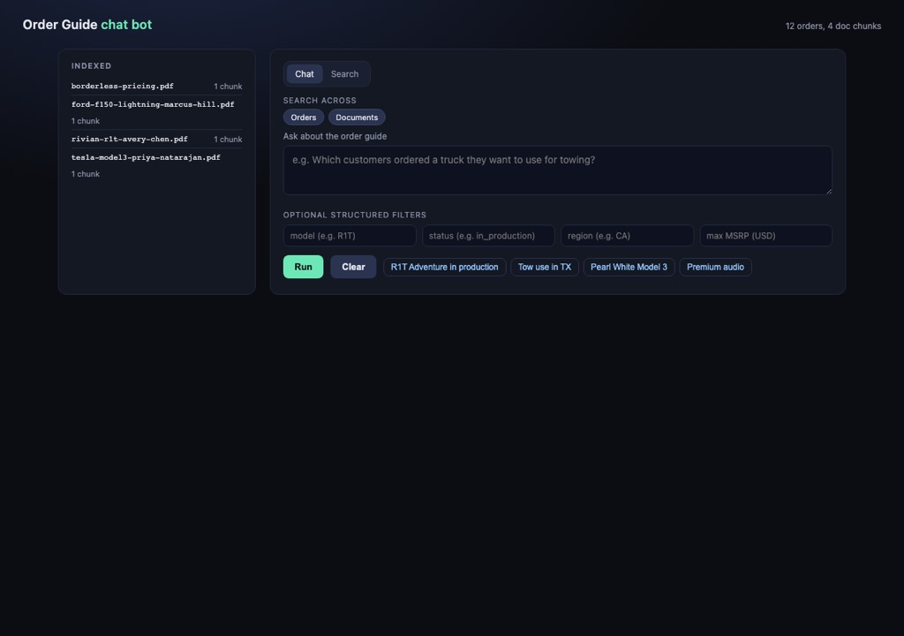
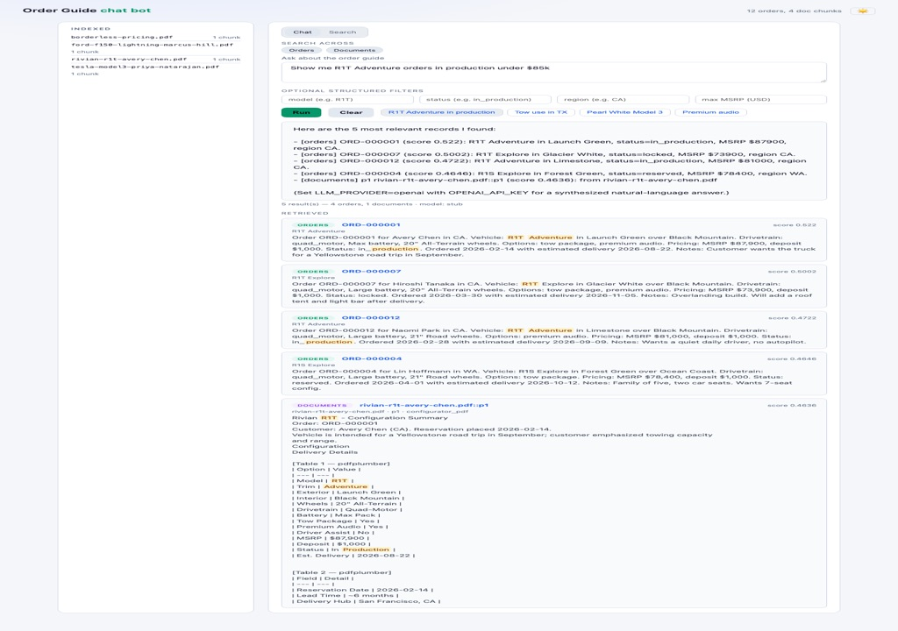
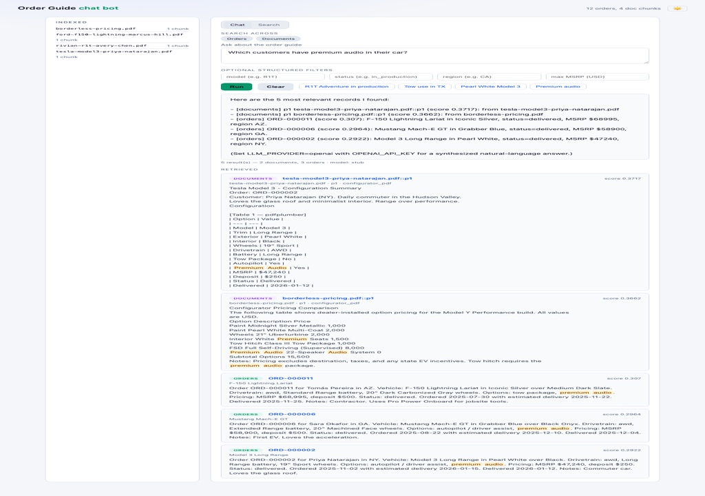
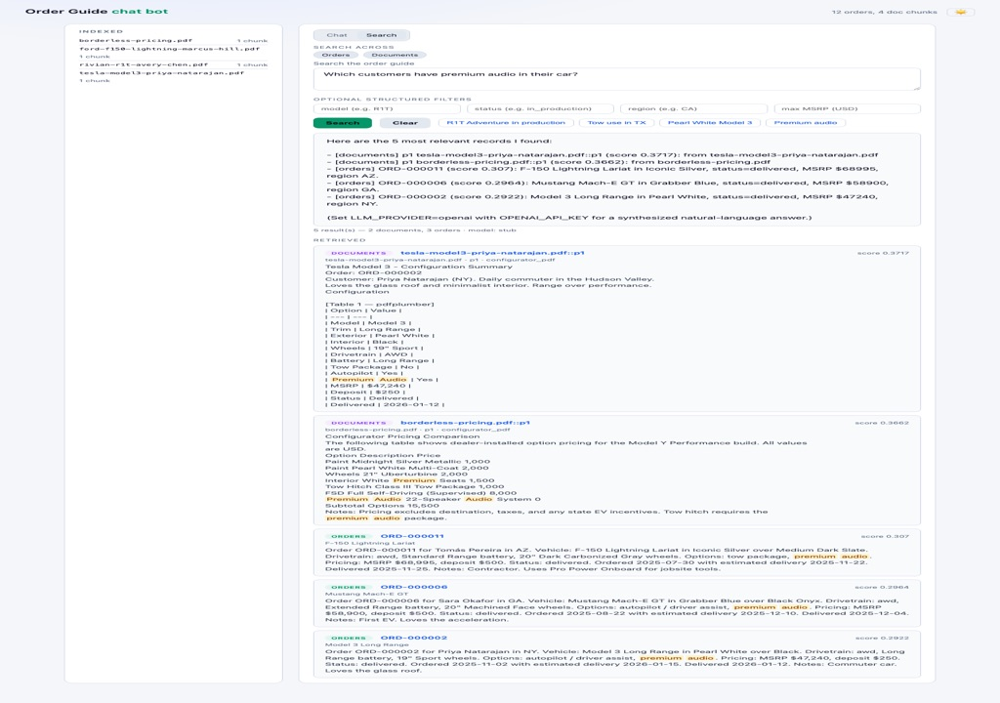
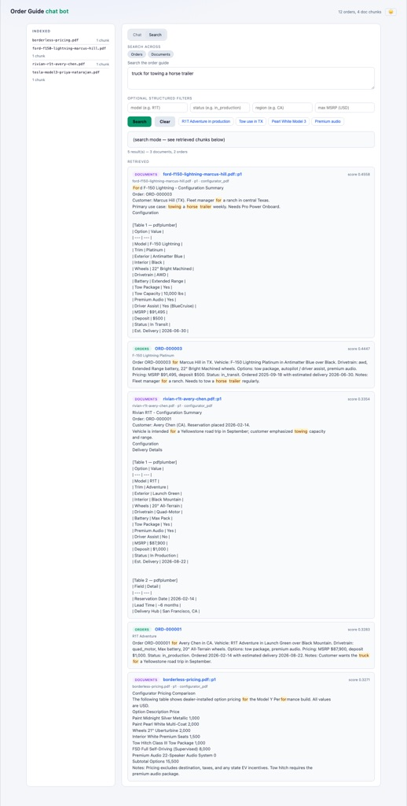
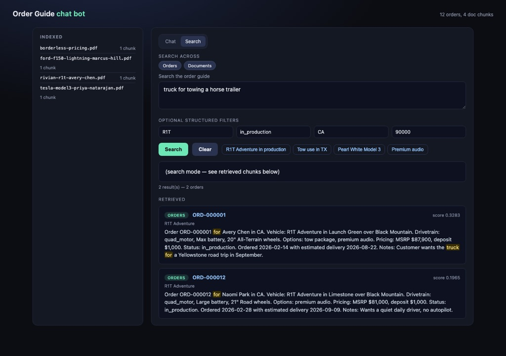
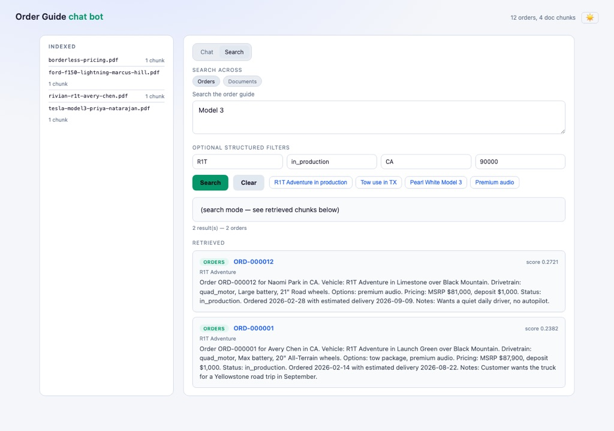
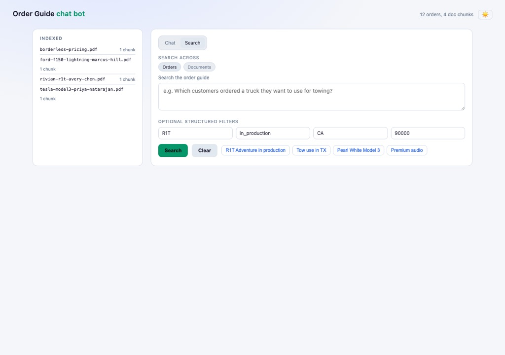
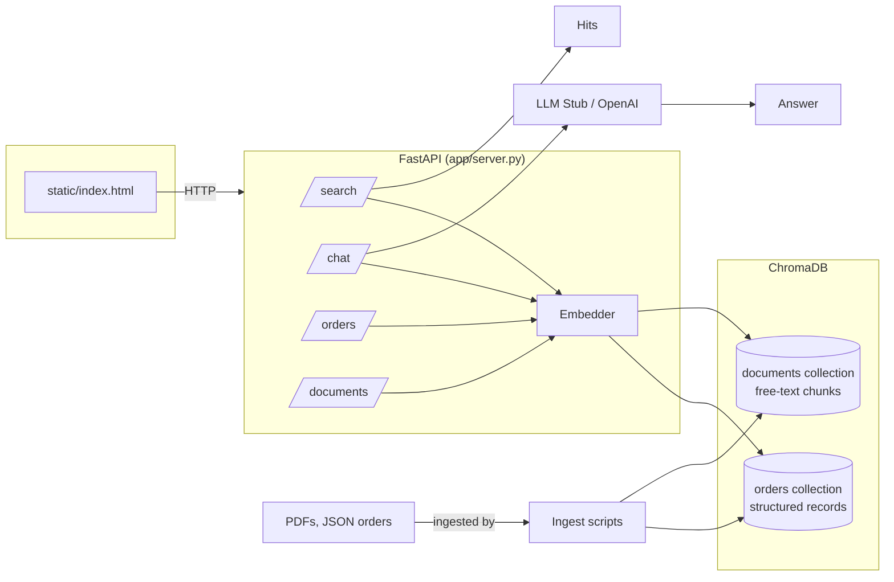

# Order Guide Chat Bot

A small, self-contained vector search engine + chat bot over a custom
vehicle configurator's order guide and PDF documents. Embeds with
sentence-transformers, stores in ChromaDB, and exposes hybrid (semantic +
structured filter) search and a RAG chat endpoint.

This project is licensed under the [MIT License](LICENSE).

## Screenshots

| Feature | Preview |
|---------|---------|
| Home page with indexed data | [](assets/01-home-with-data.jpg) |
| Chat mode — quick example query | [](assets/02-chat-example.jpg) |
| Chat mode — manual question | [](assets/03-chat-query.jpg) |
| Search tab | [](assets/04-search-tab.jpg) |
| Search results with highlights | [](assets/05-search-results.jpg) |
| Structured filters applied | [](assets/06-filtered-search.jpg) |
| Source pill filter (Orders only) | [](assets/07-source-filter.jpg) |
| Empty state | [](assets/08-empty-state.jpg) |

To regenerate these, run:

```bash
uv run python -m scripts.take_screenshots
```

## Architecture



| Layer        | Choice                                              |
| ------------ | --------------------------------------------------- |
| Embeddings   | `sentence-transformers/all-MiniLM-L6-v2` (384 dim)  |
| Vector store | ChromaDB (persistent, in-process, cosine distance)  |
| Collections  | `orders` (structured Order records) + `documents` (free-text chunks) |
| API          | FastAPI + Uvicorn                                   |
| PDF parsing  | pdfplumber (text layer + per-page tables)           |
| LLM          | Stub by default; OpenAI-compatible if `OPENAI_API_KEY` is set |
| UI           | Single static HTML page, no build step              |

## Setup (uv)

```bash
uv sync --extra dev          # creates .venv, installs deps, writes uv.lock
cp .env.example .env
```

The first sync downloads the embedding model `all-MiniLM-L6-v2` (~90 MB)
into the Hugging Face cache, so the first run is slower than subsequent ones.

## Ingest data

### Structured orders (JSON)

```bash
uv run python -m scripts.ingest data/sample_orders.json
# -> loaded 12 orders from data/sample_orders.json (collection: 0 -> 12)
```

### PDFs

```bash
# Generate sample configurator PDFs (one customer config per PDF)
uv run python -m scripts.make_sample_pdfs

# Ingest a single PDF, a list, or a folder (recursive)
uv run python -m scripts.ingest_pdf data/sample_pdfs
# -> ingested 3 chunk(s) from 3 file(s) (documents collection: 0 -> 3)

# Tag PDFs with a custom kind
uv run python -m scripts.ingest_pdf path/to/folder --kind order_guide
```

#### Table extraction backends

Table extraction is pluggable. By default only `pdfplumber` is used; opt
into additional backends via the `--fallback` CLI flag or the
`PDF_TABLE_BACKENDS` env var (comma-separated, tried in order).

| Backend     | Best for                                    | Extra deps                          |
| ----------- | ------------------------------------------- | ----------------------------------- |
| `pdfplumber`| Default; bordered tables, fast              | (already installed)                 |
| `camelot`   | Lattice (bordered) and stream (borderless)  | `uv sync --extra pdf-camelot` + Ghostscript |
| `vision`    | Scanned / irregular / hard layouts          | API key: `OPENAI_API_KEY` or `ANTHROPIC_API_KEY` |

Backends are only consulted when the previous one returned no tables AND
the page has at least `PDF_TABLE_MIN_CHARS` (default 80) characters of
text — so you don't pay for vision calls on pages pdfplumber already
handled.

```bash
# Try pdfplumber first, then Camelot for any page pdfplumber missed
uv run python -m scripts.ingest_pdf folder --fallback camelot

# Same, plus a vision LLM as the final fallback
PDF_TABLE_BACKENDS=pdfplumber,camelot,vision \
PDF_VISION_PROVIDER=openai \
OPENAI_API_KEY=sk-... \
  uv run python -m scripts.ingest_pdf folder

# Inspect what each page produced
uv run python -m scripts.ingest_pdf file.pdf --fallback camelot --debug data/debug
```

## Run the server

```bash
uv run python -m app.server
# -> http://127.0.0.1:8000  (UI),  /docs for Swagger
```

## API

### `POST /search` — hybrid semantic + structured search

```bash
curl -s http://127.0.0.1:8000/search \
  -H 'content-type: application/json' \
  -d '{
    "query": "truck for towing a horse trailer",
    "top_k": 3,
    "filters": {"customer_region": "TX"},
    "sources": ["orders", "documents"]
  }'
```

| Field     | Type     | Notes                                                  |
| --------- | -------- | ------------------------------------------------------ |
| query     | string   | Natural-language question                              |
| top_k     | int      | Number of results after merging both collections       |
| filters   | object?  | Chroma where clause; e.g. `{"status":"in_production"}` |
| sources   | string[] | Subset of `["orders","documents"]`; default both       |

Filters support `eq`, `$ne`, `$in`, `$gte`, `$lte`, `$and`, `$or`.
Example: `{"msrp_usd": {"$lte": 50000}, "status": {"$in": ["reserved","locked"]}}`.

### `POST /chat` — RAG over retrieved records

```bash
curl -s http://127.0.0.1:8000/chat \
  -H 'content-type: application/json' \
  -d '{"question":"Which truck is configured for towing a horse trailer?","top_k":3}'
```

With `LLM_PROVIDER=stub` (default), the answer is a deterministic list of
retrieved records — useful for development and tests. To get a real LLM
answer, set in `.env`:

```
LLM_PROVIDER=openai
OPENAI_API_KEY=sk-...
OPENAI_MODEL=gpt-4o-mini
```

You can also point at any OpenAI-compatible endpoint via `OPENAI_BASE_URL`.

### Other endpoints

| Method | Path                       | Purpose                                       |
| ------ | -------------------------- | --------------------------------------------- |
| GET    | `/`                        | UI                                            |
| GET    | `/health`                  | Liveness + counts                             |
| GET    | `/stats`                   | Counts + per-source document breakdown        |
| POST   | `/orders`                  | Ingest one order                              |
| POST   | `/orders/bulk`             | Ingest a list of orders                       |
| DELETE | `/orders/{order_id}`       | Remove an order                               |
| POST   | `/documents`               | Ingest document chunks (id, text, metadata)   |
| DELETE | `/documents/{chunk_id}`    | Remove a document chunk                       |

## Design notes

### Data model

Two side-by-side collections, merged on retrieval:

- **`orders`**: one chunk per Order. The natural-language description
  drives semantic match; Order fields (status, model, region, msrp,
  booleans) live in metadata and are filterable.
- **`documents`**: free-text chunks with arbitrary flat metadata. PDF
  ingestion creates one chunk per page, with `source`, `kind`, `page`,
  `n_tables`, `n_chars` in metadata.

Search fetches `max(top_k, 5)` from each selected source, merges by
similarity, and returns the top `top_k` overall. The same call can
retrieve an Order record and a PDF page that describe the same customer.

### PDF extraction

- Uses `pdfplumber` for both the text layer and table detection.
- Table extraction is pluggable via a backend chain configured by
  `PDF_TABLE_BACKENDS` (default: `pdfplumber`). Add `camelot` and/or
  `vision` to recover tables pdfplumber misses — see the **Table
  extraction backends** section above.
- Each page becomes one chunk. Table rows are rendered as Markdown
  tables (`| col | col |`) and **deduplicated** against the text layer
  so the same content isn't embedded twice.
- Camelot's stream mode sometimes returns a placeholder header
  (`0/1/2`) or folds a paragraph into the first row; the orchestrator
  post-processes Camelot output to find the real header.
- Pages with no text and no tables are skipped.
- Born-digital PDFs only by default. Scanned/image-based PDFs will
  produce empty chunks (the `low_text` metadata flag is set). The
  `vision` backend is the recommended escape hatch for scanned or
  irregular layouts: it renders the page to PNG via `pypdfium2` and
  asks a vision LLM to return tables as JSON. A Tesseract OCR pass
  is the cheap alternative for purely-scanned pages with simple tables.
- Chunk ids are deterministic (`{source}::p{page}`) so re-ingesting
  the same PDF upserts rather than duplicating.

### Why not structured parsing of PDFs into Order records?

Configurator PDFs are heterogeneous and the prototype is supposed to
handle whatever shape comes in. The chunk + embed path is robust to
layout changes; structured parsing is brittle. If you later need to
populate Order records from PDFs, the right place is a separate
parser/normalizer that runs on top of the extracted chunks and
calls `upsert_orders`.

### Pluggable LLM

`stub` works offline with zero API keys. The `openai` provider is a
thin Chat Completions call; swap to Anthropic, Ollama, etc. by adding
another branch in `app/llm.py`.

### Scale

ChromaDB + a single embedding model on one machine is comfortable to
~1M 384-dim vectors. Past that, move to Qdrant / Weaviate / pgvector
and consider a stronger embedder (e.g. `bge-m3`, `e5-large-v2`, or an
API model).

## Tests

```bash
uv run pytest tests/ -v
```

16 tests cover: order ingest, semantic search, structured filters,
hybrid (filter + semantic) queries, PDF extraction, PDF ingest,
merged cross-collection search, the pdfplumber backend, the Camelot
fallback (lattice + stream with header rotation), and the vision
backend (mocked LLM calls).
